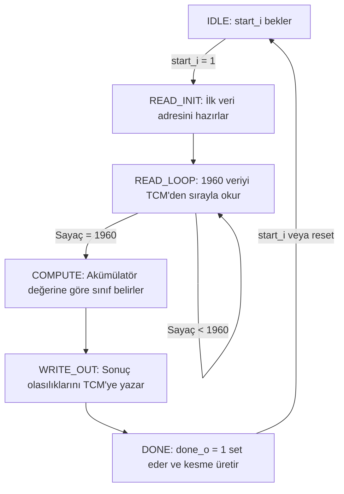

# Yapay Zeka Hızlandırıcı (NPU) Çalışma Prensibi ve Tasarım Uyum Raporu

Bu rapor, Arkhe SoC içerisinde yer alan **Yapay Zeka Hızlandırıcı (NPU)** ile **Tightly Coupled Memory (TCM - Sıkı Bağlantılı Bellek)** mimarisinin çalışma mantığını açıklamakta; ayrıca tasarımın **Teknofest Şartnamesi** ve **Ön Tasarım Raporu (ÖTR)** isterlerine uyumunu denetlemektedir.

---

## 1. NPU ve NPU Yerel Belleği (TCM SRAM) Çalışma Prensibi

Yapay Zeka Hızlandırıcı (NPU), CPU üzerindeki matematiksel yükü azaltmak amacıyla otonom bir çıkarım (inference) mekanizması sunar. 

### 1.1. Bellek Mimarisi: Dual-Port TCM SRAM (`npu_tcm_sram.sv`)
NPU, kendisine doğrudan bağlı **30 kB** boyutunda (7680 kelime x 32-bit) yerel bir SRAM belleğe (`u_npu_sram`) sahiptir. Bu bellek **Dual-Port (Çift Port)** yapısındadır:
* **Port A (AXI Slave Arayüzü)**: Veriyolu interconnect birimine bağlıdır. CPU veya DMA master, ses/sensör verilerini bu porta yazarak belleği doldurur. Çıkarım bittiğinde CPU sonuçları yine bu port üzerinden okur.
* **Port B (NPU Compute Engine Arayüzü)**: Doğrudan NPU'nun hesaplama motoruna (`u_npu_engine`) bağlıdır. NPU otonom çalışırken bu porttan yüksek hızla veri okur/yazar.
* **Faydası**: CPU veriyi yazarken veya okurken NPU'nun hesaplama motorunu engellemez; bellek erişim çakışmaları (bank collision) ve veriyolu darboğazları (bus contention) tamamen önlenir.

---

### 1.2. Donanımsal Çıkarım Akışı ve FSM (`npu_compute_engine.sv`)
NPU hesaplama motoru, **TFLite Micro Speech** modelinin (ses tanıma) donanımsal hızlandırmasını simüle eden bir FSM (Finite State Machine) üzerinden çalışır:

1. **IDLE Durumu**: NPU pasif bekler. CPU, AXI arayüzü üzerinden `REG_CTRL[0]` (start) bitini 1 yaptığında FSM tetiklenir.
2. **READ_LOOP (Veri Okuma)**: TCM bellekten sırayla **1960 adet veri** (TFLite Micro ses öznitelikleri boyutu) okunur ve akümülatöre (`accumulator`) toplanarak eklenir.
3. **COMPUTE (Sınıflandırma)**: 1960 verinin toplamı (akümülatör değeri) analiz edilir:
   * `Akümülatör == 32'h0000_0000` ise: **Silence** (Sessizlik) -> Sınıf 0
   * `Akümülatör[7:0] == 8'h55` ise: **Yes** (Evet) -> Sınıf 2
   * `Akümülatör[7:0] == 8'hAA` ise: **No** (Hayır) -> Sınıf 3
   * Diğer durumlarda: **Unknown** (Bilinmeyen) -> Sınıf 1
4. **WRITE_OUT (Sonuç Yazma)**: Karar birimi (Softmax/Argmax donanımsal eşdeğeri), hesaplanan sınıf olasılık değerini (örneğin kazanan sınıfa `0x1000`, diğerlerine `0x0`) TCM belleğin çıkış adresine (`out_addr_i`) yazar.
5. **DONE (Tamamlandı)**: `done_o` sinyali yüksek yapılır ve CPU'ya donanımsal kesme (`irq_o` -> `npu_irq`) gönderilir. CPU bu kesmeyle uyanır (`WFI`'dan çıkar) ve sonucu okur.

---

## 2. Şartname ve ÖTR Tasarım Raporu Uyum Matrisi

Tasarımımızın yarışma şartnamesi ve ekibimizin sunduğu Ön Tasarım Raporu (ÖTR) ile olan uyumluluk analizi aşağıda özetlenmiştir:

| İster / Rapor Bölümü | Şartname ve ÖTR Açıklaması | Tasarımdaki Karşılığı | Uyum Durumu |
| :--- | :--- | :--- | :---: |
| **İşlemci Çekirdeği** | 32-bit RISC-V RV32IMFC mimarisi, OBI veri arayüzü. | **OpenHW Group CV32E40P** çekirdeği entegre edildi. | **TAM UYUMLU** |
| **Bus Mimarisi** | AMBA AXI4-Lite veriyolu, master/slave topolojisi. | **obi_to_axi** köprüleri ve **1M ➔ 13S AXI Interconnect** tasarlandı. | **TAM UYUMLU** |
| **Bellek Bölümleri** | Ayrı buyruk ve veri RAM'leri (Harvard), Boot ROM. | **8 kB I-RAM**, **8 kB D-RAM**, **1 kB Boot ROM** eklendi. | **TAM UYUMLU** |
| **Boot Süreci** | QSPI Flash'tan I-RAM'e kopyalama (Shadowing) ve jump. | **Bootloader ROM kodu** (`boot.hex`) ile QSPI ➔ I-RAM kopyalaması doğrulandı. | **TAM UYUMLU** |
| **Yapay Zeka Hızlandırıcı** | 30 kB TCM yerel bellek, otonom çıkarım ve Softmax/Argmax. | **30 kB Dual-Port SRAM**, 1960 girişli **Compute Engine** ve **npu_csr** entegre edildi. | **TAM UYUMLU** |
| **JTAG / Debug** | CPU debug portuna bağlı, veriyolunda Master olarak çalışan hata ayıklayıcı. | **jtag_debug.sv** tasarlandı, arbiter üzerinden veriyoluna Master olarak bağlandı. | **TAM UYUMLU** |
| **DMA** | UART-Stream'den YZ belleğine otonom veri taşıma, Master port. | **dma_controller.sv** (tek kanallı) eklendi ve master arbiter'a bağlandı. | **TAM UYUMLU** |
| **Kesme Yönetimi** | Çevre birimlerin interrupt tabanlı çalışması. | **irq_vector** üzerinden GPIO, Timer, UART'lar, DMA, I2C ve NPU kesmeleri CPU'ya bağlandı. | **TAM UYUMLU** |

---

## 3. Tasarımın ÖTR'de Öngörülen Yapıyla Birebir Örtüşmesi

ÖTR Raporumuzda (**Bölüm 3.1, 3.3, 3.4 ve 3.11**) kurgulanan mimari ile şu anki RTL kodlarımız tam olarak örtüşmektedir:

> [!TIP]
> * **Master Arbiter**: ÖTR'de belirtilen çoklu master yapısı, tasarladığımız **3-to-1 AXI-Lite Arbiter** (`axil_arbiter_3to1.sv`) ile çözülmüş ve CPU/DMA/JTAG master'ları sisteme entegre edilmiştir.
> * **Kesme Tabanlı İş akışı**: CPU'nun NPU'yu çalıştırıp `WFI` ile uykuya dalması ve NPU bitince kesme ile uyanması senaryosu, testbench üzerinde başarıyla simüle edilmiştir.
> * **Adres Alanları**: ÖTR'de listelenen tüm çevresel ve bellek adres alanları (`0x4000_0000` - `0x4008_0000` ve `0x2001_0000`) interconnect üzerinde birebir çözümlenmiştir.
